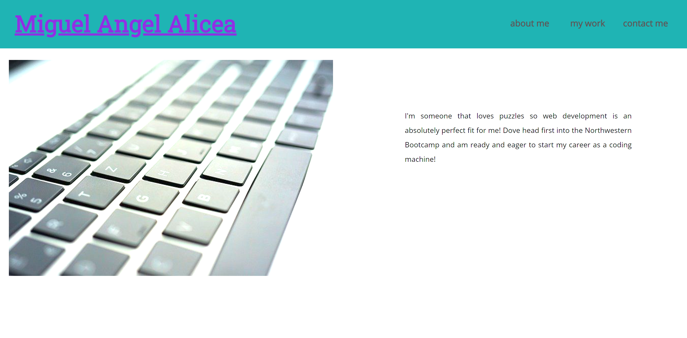

## React Portfolio

## Description

Created a single page app using react.

## Table of Contents

- [Usage](#Usage)
- [License](#License)
- [Questions](#Questions)
- [Acknowledgements](#Acknowledgements)
- [Screenshots](#Screenshots)

## Usage

Click here to see my [portfolio](https://malicea0783.github.io/react-porfolio). 

## License

MIT

## Questions

For additional information please contact me via GitHub at [github.com/malicea0783](https://github.com/malicea0783) or via email at [malicea0783@gmail.com](mailto:malicea0783@gamil.com?subject=[GitHub]%Budget%Tracker).

## Acknowledgements

Valerie Michalecki: [github.com/vmichalecki](https://github.com/vmichalecki)

## Screenshots

